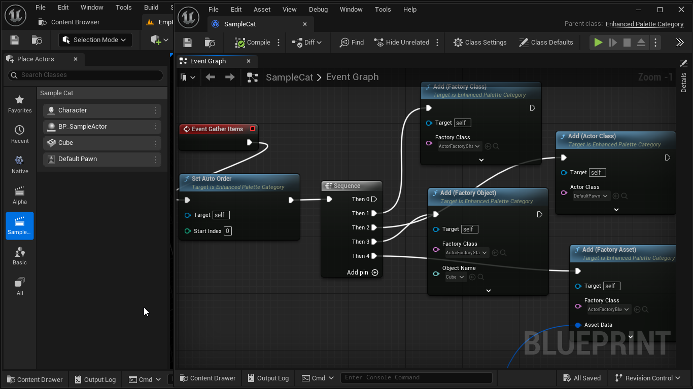

## Enhanced Palette Plugin for Unreal Engine

> [!NOTE]
> This plugin is currently Experimental Stage, while being functionally complete there is room for usability improvements and new features.

This plugin extends the capabilities of Unreal Editor `Place Actors` panel, allowing it to be customized from Editor Settings and granting the ability to dynamically generate category content.

The primary plugin application is aimed at completing following usage scenarios:
* Custom category for per-project items used globally across project.
* Custom category for per-project items gathered from project assets (for example selecting by AssetDataTag, Class etc).
* Custom category for per-level items, generated based on active Level Editor World (for example gathering actors and filtering by tag).
* Other cases where having custom list of placeable items would be useful.
* Hiding not needed standard engine categories from sight (VR, Test) or reordering them.
* Editing `Recently Placed` category.

Plugin provides three "types" of defining custom palette categories: Static, Dynamic and External.

### Static Category

Category defined in settings panel with fixed list of placeable items.

### Dynamic Category

A Class or Blueprint containing category information and implementing placeable item selection logic.

External triggers can trigger dynamic category content update.

Dynamic categories registered in Plugin Settings or they can be automatically discovered if enabled.

> [!IMPORTANT]
> Palette Category classes must inherit `UEnhancedPaletteCategory` and be part of Editor/UncookedOnly module.
> 
> Native category example can be found at `Source/EnhancedPalette/Private/Tests/ExampleNativeCategory.cpp`

### External Category

Subsystem exposes functions to register and populate categories in runtime from editor utility blueprints.

> [!IMPORTANT]
> This mode is an experiment.

## Unreal Engine Versions

Plugin relies on Instanced Structs usage, compiles and tested on UnrealEngine 5.4 and 5.5, other engine versions would need some patching as engine internals change.

## License

Enhanced Palette Plugin is available under the MIT license. See the LICENSE file for more info.

## Image Previews

